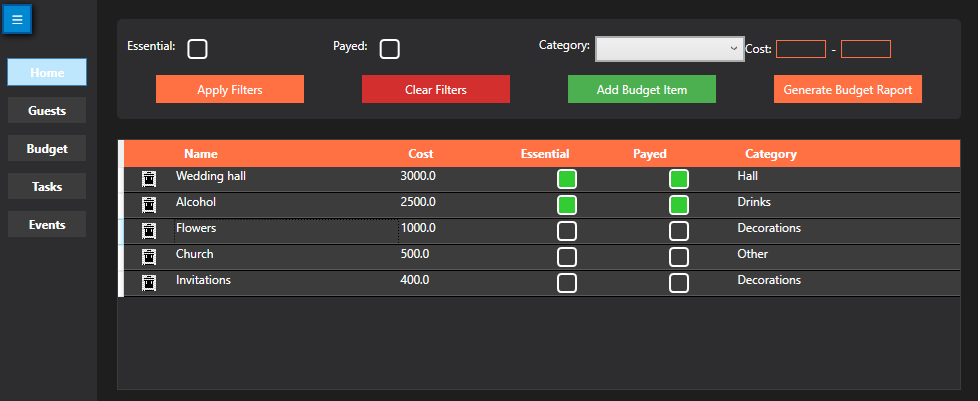
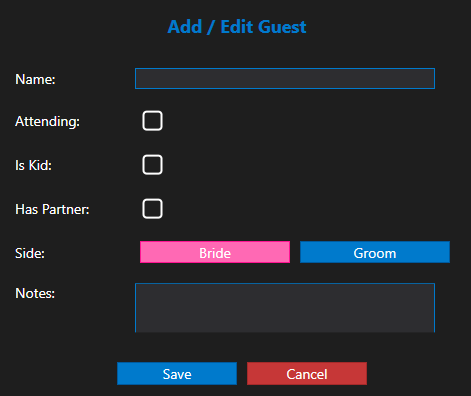
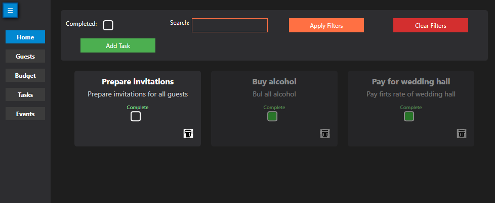
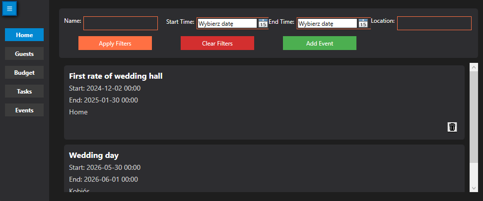

# Wedding Planner Application

## Overview

The Wedding Planner Application is a C# desktop application designed to help users efficiently manage and plan weddings. It provides tools for budget management, guest list organization, task tracking, and event scheduling. Additionally, it allows users to generate detailed budget reports for better financial oversight.

## Features

1. Budget Management

- Track wedding-related expenses.

- Add, edit, and view budget items.

- Categorize expenses to maintain clarity.

- Generate PDF budget reports for easy sharing and analysis.

2. Guest List Management

- Add and manage guest information.

- Categorize guests based on their association (e.g., bride’s side, groom’s side).

- Keep track of RSVPs and seating arrangements.

3. Task Management

- Add, edit, and delete wedding-related tasks.

- Mark tasks as completed.

4. Event Planning

- Schedule and manage wedding events (e.g., rehearsal dinner, ceremony, reception).

- Keep track on what's most important

- View event details in an organized manner.

5. Budget Report Generation

- Automatically create PDF reports summarizing wedding expenses.

- Group expenses by category.

- Calculate total costs and display them in the report.

## Technologies Used

- Language: C#

- Framework: .NET

- Database: SQLite for data storage

- UI Framework: WPF (Windows Presentation Foundation)

- PDF Generation: iText7 library

- LINQ for filtering data

## Installation and Setup

### Prerequisites:

- Windows operating system.

- .NET runtime installed.

### Steps:

- Clone the repository:

`git clone https://github.com/bl4szk4/wedding-planner.git`

- Open the project in Visual Studio.

- Build the solution to restore dependencies.

- Run the application from Visual Studio or create a release build.

### Database Initialization:

- The application will automatically create the database (weddingPlanner.db) in the Reports folder if it does not exist.

- All necessary tables will be initialized, and migrations will be applied.

### Main Functionalities

- Navigate through the menu to access different sections (e.g., Budget, Guest List, Tasks, Events).

- Use the intuitive interface to add, view, and manage data.

- Generate Reports

- Navigate to the Budget section.

This project is licensed under the MIT License. See the LICENSE file for details.

